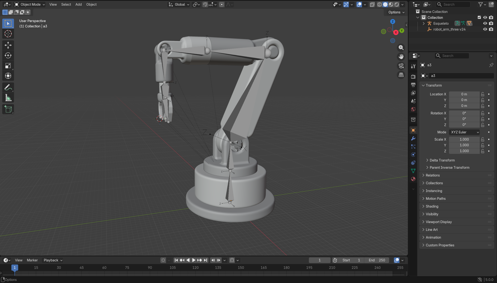
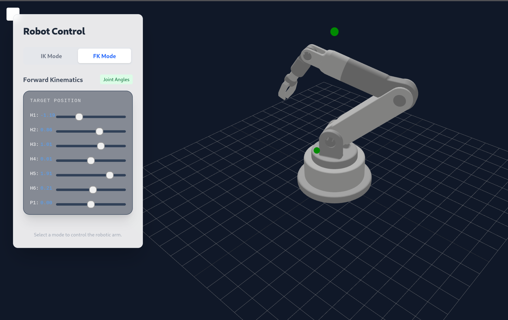

# WebRoboLab - Virtual Robotic Arm Laboratory

[](https://webrobolab.j-cardenas.com/)
[](LICENSE)

WebRoboLab is a virtual laboratory designed for the simulation and control of a 6-axis robotic arm. This project leverages the power of web technologies to provide an interactive 3D environment where users can experiment with robotic kinematics.

The robotic arm was modeled using **Fusion 360** and **Blender**, utilizing bone chains for realistic articulation. The rendering and physics engine are powered by **Three.js** via **React Three Fiber**.

🚀 **[Try the live demo here](https://webrobolab.j-cardenas.com)**



## Features

The platform offers two distinct control modes to explore different aspects of robotics:

### 1. Inverse Kinematics (IK) Mode
In this mode, users can define the target coordinates (X, Y, Z) in 3D space. The system calculates the necessary joint angles to reach the target using the **CCD (Cyclic Coordinate Descent)** algorithm.

- **Target-based control**: Simply move the target marker, and the arm follows.
- **Real-time calculation**: Smooth and interactive inverse kinematics.


### 2. Forward Kinematics (FK) Mode / Total Control
This mode provides manual control over each of the 6 axes individually. It is ideal for understanding how each joint affects the overall position and orientation of the end-effector.

- **Individual Joint Control**: Sliders to adjust the angle of each axis.
- **Precise positioning**: Fine-tune the arm's pose manually.



## Technology Stack

This project is built using modern web technologies:

- **[React](https://react.dev/)**: Frontend framework for building the user interface.
- **[Three.js](https://threejs.org/)**: 3D library for rendering graphics in the browser.
- **[React Three Fiber](https://docs.pmnd.rs/react-three-fiber)**: React renderer for Three.js.
- **[React Three Drei](https://github.com/pmndrs/drei)**: Useful helpers for React Three Fiber.
- **[Tailwind CSS](https://tailwindcss.com/)**: Utility-first CSS framework for styling.
- **[Vite](https://vitejs.dev/)**: Next Generation Frontend Tooling.

## Getting Started

To run this project locally, follow these steps:

### Prerequisites
Make sure you have [Node.js](https://nodejs.org/) installed on your machine.

### Installation

1. Clone the repository:
```bash
   git clone https://github.com/JCardenas05/WebRoboLab.git
   cd WebRoboLab
```

2. Install dependencies:
```bash
   npm install
```

3. Start the development server:
```bash
   npm run dev
```

4. Open your browser and navigate to the URL shown in the terminal (usually `http://localhost:5173`).

## License

[MIT](LICENSE)

## Author

**J. Cárdenas**
- Website: [j-cardenas.com](https://j-cardenas.com)
- Project: [WebRoboLab](https://j-cardenas.com/webrobolab/)

---
